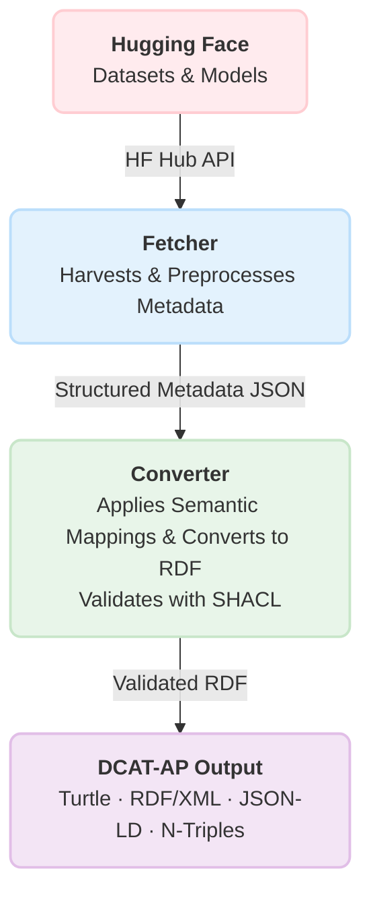

# hf2dcat: Harvest and Convert Hugging Face Metadata to DCAT-AP RDF

## hf2dcat is a Python command-line tool that fetches metadata from [Hugging Face (HF)](https://huggingface.co/) datasets and models and converts it into [DCAT-AP 3.0.0](https://semiceu.github.io/DCAT-AP/releases/3.0.0/)–compliant RDF for integration into semantic data catalogs. By standardizing and validating metadata from AI datasets and models, it bridges the gap between the rapidly growing AI ecosystem and formal data-catalog standards—enabling AI artifacts to be discovered, indexed, and reused as machine-actionable resources within open data ecosystems.

## Tool Workflow



### **hf2dcat operates through a robust, two-stage pipeline:**
### Stage 1 — Harvesting & Preprocessing

**Collects and prepares metadata from Hugging Face**

- Multi-source ingestion (DatasetInfo/ModelInfo, Croissant metadata, dataset/model cards, Parquet metadata)

- Extracts properties such as license, languages, region, and linked papers (arXiv/DOI), and collects description text when available

- Builds distribution profiles (filenames, formats, sizes, URLs)

- Output: A clean structured metadata JSON 

### Stage 2 — Semantic Conversion & Validation

**Transforms preprocessed metadata into standards-compliant RDF.**

- Applies semantic mappings to generate DCAT-AP 3.0.0 classes and properties

- Provenance tracking: Adds PROV-O metadata describing generation context

- SHACL validation: Ensures full conformance with DCAT-AP SHACL shapes

- Output: Publication-ready RDF (Turtle, RDF/XML, JSON-LD, N-Triples)

## Commands

### hf2dcat provides three subcommands:

### 1. **`fetch` — Harvest and preprocess Hugging Face dataset/model metadata as JSON**
- Retrieves metadata for Hugging Face datasets or models and performs preprocessing before saving the results as JSON.  

- By default, **filters out** restricted resources(e.g. private, disabled, gated or license-limited datasets or models).  

#### - **Name fetch mode** — Fetch metadata for explicitly specified datasets/models
  - Provide dataset or model names directly using `--dataset-name/-d`  or `--model-name/-m` 
  - Or supply a list of names via file using `--dataset-name-file/-D` or `--model-name-file/-M`

#### - **Batch fetch mode** — Fetch metadata for a set of datasets or models 
  - Specify`--fetch-type/-t` (e.g. dataset, model or both)
  - Optionally set `--limit/-l` and provide extra filters with `--params/-p`
  - Supports sorting by **downloads**, **trending** or **likes**
  - Defaults to fetching the top-`limit` datasets or models ranked by **downloads**
    
### 2. **`convert` — Convert Hugging Face metadata JSON to DCAT-AP RDF**
  - Supports multiple RDF formats (RDFXML, TURTLE, JSONLD, NTRIPLES)
  - Automatically validates output against DCAT-AP 3.0.0 SHACL shapes
  - Optionally translate description text from English → German
  - Automatically archives old output files before generating new ones

### 3. **`run-all` — Execute `fetch` and `convert` in one pipeline**
  - Executes `fetch` followed by `convert`
  - Uses a shared output directory for both steps

# Installation

### Install using Poetry:

```bash
poetry install
```

### Activate the environment:

```bash
eval $(poetry env activate)
```

# Usage
## General help
### View all available commands and their options:
```bash
hf2dcat --help
hf2dcat fetch -h
hf2dcat convert -h
hf2dcat run-all -h
```
**Note**: All commands support both long (e.g., --fetch-type) and short (e.g., -t) flags.

## 1. **Fetch Hugging Face metadata**
```bash
hf2dcat fetch [OPTIONS]
```
### 1.1 Name fetch mode (one or more dataset or model by name):

**Specify dataset or model names directly (inline):**
```bash
hf2dcat fetch --dataset-name "nebius/SWE-rebench"
hf2dcat fetch --model-name "sentence-transformers/all-MiniLM-L6-v2" 
```
**Note**: Use --dataset-name/-d or --model-name/-m multiple times to fetch several items.

**Load dataset or model names from a file**
```bash
hf2dcat fetch --dataset-name-file path/to/dataset_names.txt
hf2dcat fetch --model-name-file path/to/dataset_names.txt
```
**Notes**: 
* Use --dataset-name-file/-D or --model-name-file/-M to load names from a file.
* Supported file formats: .txt (one name per line), .json (list), .csv (first column; header ignored).

---

### 1.2 Batch fetch mode (a set of dataset or models based on limit and params)

By default,

- Fetches top datasets or models ranked by downloads.

- Automatically filters out restricted resources (e.g., private, disabled, gated, or license-limited datasets/models).

**Fetch the top 20 datasets or models by downloads**
```bash
hf2dcat fetch --fetch-type dataset --limit 20
hf2dcat fetch --fetch-type model --limit 20
```
**Fetch the top 20 datasets and models by downloads** 
```bash
hf2dcat fetch --fetch-type both --limit 20
```
**Fetch without filtering (include restricted datasets/models)**

By default, restricted resources are excluded.
Use the following --no-filter-restricted/-R to include them:
```bash
hf2dcat fetch --fetch-type dataset --limit 20 --no-filter-restricted
hf2dcat fetch --fetch-type  model --limit 20 --no-filter-restricted
```

**Fetch the top 20 datasets or models by likes** 
```bash
hf2dcat fetch --fetch-type dataset --limit 20 --params '{"sort": "likes"}' 
hf2dcat fetch --fetch-type model --limit 20 --params '{"sort": "likes"}' 
```

**Fetch the top 20 datasets or models by trending (likes received over the last 7 days)**
```bash
hf2dcat fetch --fetch-type dataset --limit 20 --params '{"sort": "likes7d"}'
hf2dcat fetch --fetch-type model --limit 20 --params '{"sort": "likes7d"}'
```

## 2. **Convert Huggging Face metadata to DCAT-AP RDF**
```bash
hf2dcat convert [OPTIONS]
```
### Usage Examples

**Convert Hugging Face metadata with default output formats:**
```bash
hf2dcat convert --input-path input/hf_metadata.json
```
**Convert Hugging Face metadata and specify custom output formats:**
```bash
hf2dcat convert --input-path input/hf_metadata.json --output-format jsonld ntriples
```
**Convert Hugging Face metadata and specify output dir and base filename**
```bash
hf2dcat convert --input-path input/hf_metadata.json --output-dir results --output-base-name converted_hf_metadata
```

## 3. **Fetch and convert Hugging Face metadata in one command**

**Fetch and convert in a single pipeline (sharing the same --output-dir/-o)**.
```bash
hf2dcat run-all [OPTIONS]
```
### Usage Examples

**Fetch the top 5 datasets and models by downloads and convert the fetched metadata into DCAT-AP RDF** 
```bash
hf2dcat run-all --fetch-type both --limit 5
```

**Fetch the top 5 datasets by downloads and convert the fetched metadata into DCAT-AP RDF** 
```bash
hf2dcat run-all --fetch-type dataset --limit 5
```

**Fetch the top 5 models by downloads and convert the fetched metadata into DCAT-AP RDF** 
```bash
hf2dcat run-all --fetch-type model --limit 5
```

# License
This tool and its documentation are licensed under the **Apache License 2.0**. See the [LICENSE](LICENSE) file for details regarding rights and limitations.

# Acknowledgement 
This work is part of the project **AI Alliance Baden-Württemberg Data Platform**, funded by the **Ministry of Economic Affairs, Labour and Tourism Baden-Württemberg**. 

